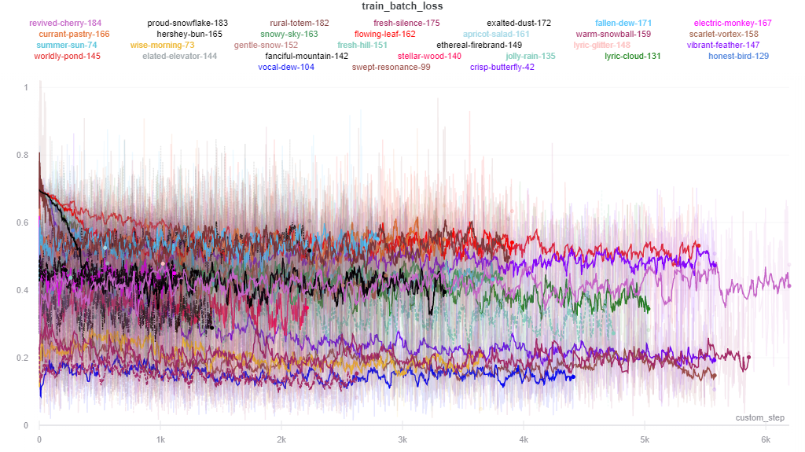

# Deepfake Detection Challenge

My solution to the [Kaggle Deepfake Detection Challenge](https://www.kaggle.com/c/deepfake-detection-challenge) to achieve top 1% on the public and private leaderboard.

The final sumbission used was an ensemble of 3 models:
- Single Frame classifier B6-EfficientNet pretrained on Imagenet
- Single Frame classifier B6-EfficientNet pretrained on Imagenet (with Cutmix data augmentation)
- Sequence of (5) frames classifier using an LSTM with B6-EfficientNet backbone with the cutmixed model as the pretrained weights while only training the head LSTM component of the network.

| Deep Fake Detection Challenge        | Public Score           | Public LB Position  |Private Score  | Private LB Position  |
| ------------- |:-------------:| -----:|-----:| -----:|
|    | 0.24397 | 12/2265| 0.46099 | 16/2265 |

Attempted various approaches at deep fake audio detection but decided against including them in the final submission due to not performing well during training.

TODO (Update README with more details)

## References

- [facenet-pytorch](https://github.com/timesler/facenet-pytorch)
- [efficientnet-pytorch](https://github.com/lukemelas/EfficientNet-PyTorch)
- [video-classification](https://github.com/HHTseng/video-classification)
- [pytorch-gradual-warmup-lr](https://github.com/ildoonet/pytorch-gradual-warmup-lr)
- [Pytorch-Audio-Emotion-Recognition](https://github.com/suicao/Pytorch-Audio-Emotion-Recognition)

